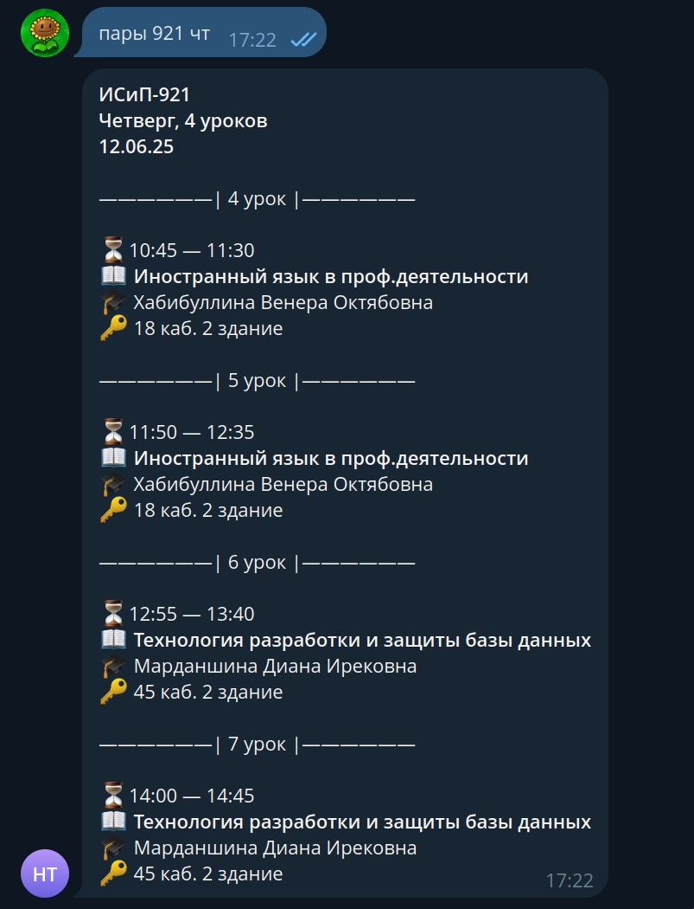

# Черная Черепаха

Телеграм-бот для просмотра расписаний [mstimetables.ru](mstimetables.ru).

Бот имеет интуитивный и приятный интерфейс, команды вводятся на естественном языке для упрощения пользования.

## Основные возможности

- [x] просмотр расписаний по дням
- [x] просмотр ФИО преподавателей
- [x] просмотр справки
- [x] регистрация пользователя для быстрого просмотра расписаний
- [ ] просмотр расписаний по неделям
- [ ] уведомления об обновлениях в расписании

### Команды

Для просмотра команд можно прописать `помощь` в личные сообщения бота.

## Установка и использование

1. С помощью Botfather создать бота.
2. Создать в корневой папке проекта `.env` файл и заполнить его по примеру `.env.example`
3. Соскрапить таблицы групп и учителей с помощью PublicationScraper:

   - `$ python3 -m venv venv`
   - `$ source venv/bin/activate`
   - `$ UUID={id} python3 scraper.py`

4. `$ docker compose up --attach bot`
5. Зайти в pgadmin, добавить в таблицу _study_entities_ группы и преподавателей, которых вы соскрапили раньше.
6. Перейти в бота и начать пользоваться.
